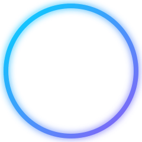

<!-- Animated Banner Top -->
<div align="center">
  
</div>

<!-- Profile Picture with Glowing Ring -->
<div align="center" style="margin-top: -100px; position: relative; z-index: 10;">
  
</div>

<!-- Name & Dynamic Title -->
<h1 align="center" style="color: #ffffff; font-weight: bold; margin-bottom: 5px;">Garvit Goel</h1>
<p align="center">
  
</p>

<!-- Above the Fold Badges -->
<p align="center">
  
  
  
</p>

---

## 👨‍💻 About Me

```bash
$ cat about.json
```

```json
{
  "name": "Garvit Goel",
  "education": "B.Tech CS&D",
  "currently": "Managing AWS infrastructure at Omniful AI",
  "focus": "Implementing IaC with Terraform & passionate about CI/CD",
  "status": "open_to_opportunities ✅"
}
```

---

## 🛠️ Skills Matrix

**☁️ Cloud & DevOps**
<p>
  
  
  
  
  
  
  
  
  
  
</p>

**💻 Languages & Tech**
<p>
  
  
  
  
  
  
  
</p>

---

## 📂 Featured Projects

<table>
  <tr>
    <td width="50%" valign="top">
      <h3 align="center">🔧 DevOps-QA Pipeline</h3>
      <p align="center">
        
        
        
        
      </p>
      <p align="center">CI/CD pipeline for automated API testing. Dockerized REST APIs tested via Jenkins triggers with Newman CLI reporting.</p>
    </td>
    <td width="50%" valign="top">
      <h3 align="center">🧠 VirtualVeins</h3>
      <p align="center">
        
        
      </p>
      <p align="center">Data analysis and statistical validation on user behavior metrics related to the impact of social media on the human brain.</p>
    </td>
  </tr>
</table>

---

## 📊 GitHub Stats & Contribution Graph

<p align="center">
  
  
</p>

<p align="center">
  
</p>

---

## 🏆 Trophies

<p align="center">
  
</p>

---

## 🤝 Connect With Me

<p align="center">
  <a href="https://www.linkedin.com/in/garvitgoel04/" target="_blank">
    
  </a>
  <a href="mailto:goelgarvit3104@gmail.com">
    
  </a>
</p>

<!-- Animated Footer -->
<div align="center">
  
</div>
